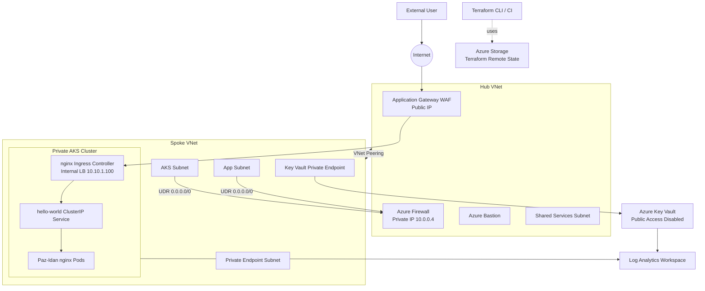
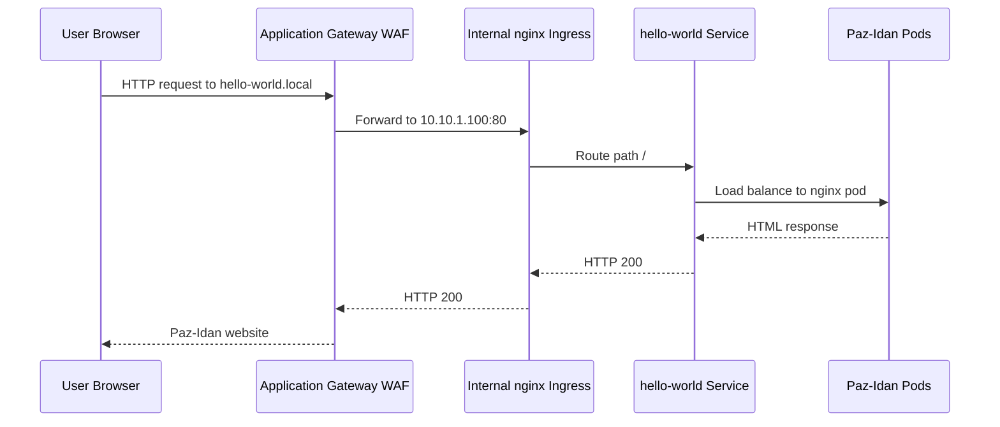
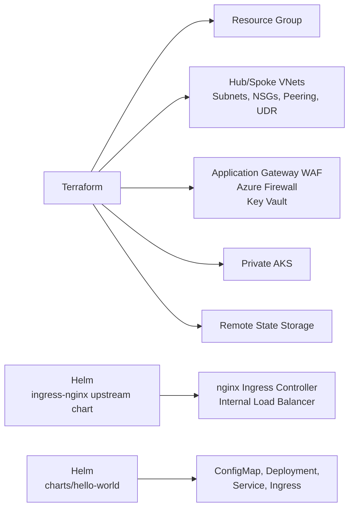
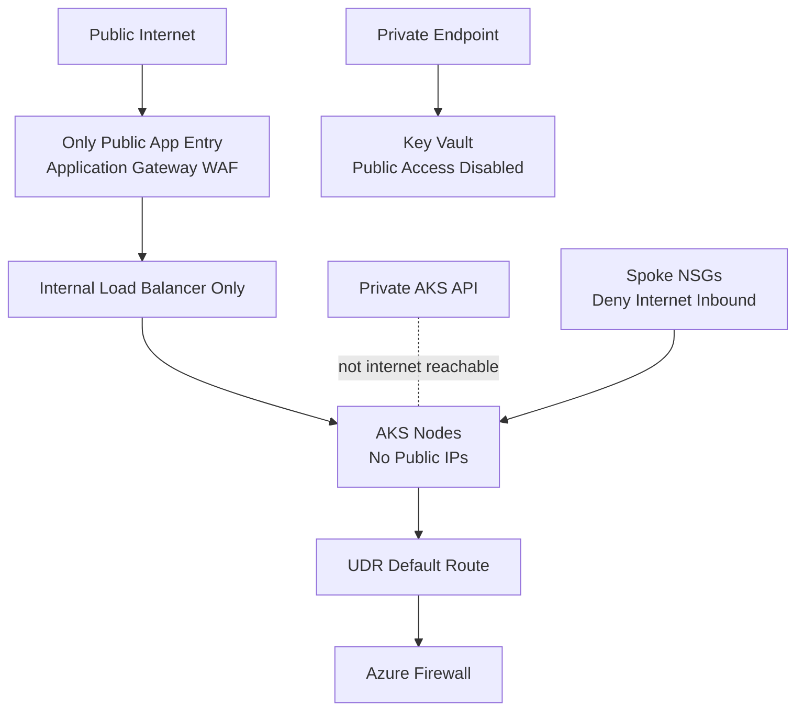

# Diagram Architecture

This document explains the project architecture with Mermaid diagrams. The
platform uses Terraform for Azure infrastructure and Helm for Kubernetes
application releases.

## High-Level Architecture

## Traffic Flow

## Deployment Ownership

## Security Control Points

## Explanation

The platform is built around a private workload model. The public internet can
reach only Application Gateway WAF. Application Gateway forwards traffic to the
private nginx ingress load balancer inside the spoke VNet. nginx ingress routes
the request to the `hello-world` ClusterIP service, which then sends traffic to
the `Paz-Idan` nginx pods.

The AKS API is private, AKS nodes have no public IP addresses, and Kubernetes
does not expose a public load balancer. Spoke subnet NSGs deny inbound internet
traffic. AKS and app subnet egress use a default route to Azure Firewall.

Hub and Spoke communicate through VNet peering only in the default design. The
project does not deploy VPN gateways, ExpressRoute circuits, or NAT gateways.

Key Vault is private-first: public access is disabled, a private endpoint is
deployed in the spoke private endpoint subnet, private DNS is linked to the
spoke VNet, and diagnostics are sent to Log Analytics.

Terraform owns Azure infrastructure. Helm owns Kubernetes app releases. This
keeps cloud resource lifecycle and application rollout lifecycle separate and
easier to operate.
